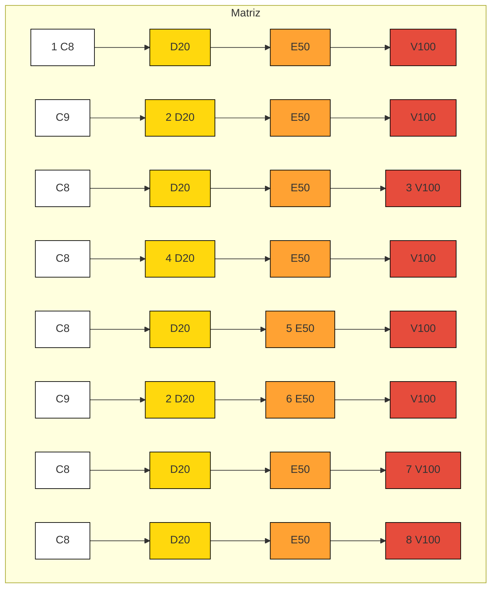

# Metodo-Agil-Crystal

```mermaid
graph TD
  subgraph Matriz
A1["1 C8"]:::branco --> A2["D20"]:::amarelo --> A3["E50"]:::laranja --> A4["V100"]:::vermelho
B1["C9"]:::branco --> B2["2 D20"]:::amarelo --> B3["E50"]:::laranja --> B4["V100"]:::vermelho
C1["C8"]:::branco --> C2["D20"]:::amarelo --> C3["E50"]:::laranja --> C4["3 V100"]:::vermelho
D1["C8"]:::branco --> D2["4 D20"]:::amarelo --> D3["E50"]:::laranja --> D4["V100"]:::vermelho
E1["C8"]:::branco --> E2["D20"]:::amarelo --> E3["5 E50"]:::laranja --> E4["V100"]:::vermelho
F1["C9"]:::branco --> F2["2 D20"]:::amarelo --> F3["6 E50"]:::laranja --> F4["V100"]:::vermelho
G1["C8"]:::branco --> G2["D20"]:::amarelo --> G3["E50"]:::laranja --> G4["7 V100"]:::vermelho
H1["C8"]:::branco --> H2["D20"]:::amarelo --> H3["E50"]:::laranja --> H4["8 V100"]:::vermelho

end
classDef branco fill:#fff, stroke:#000, stroke-width:1px;
classDef amarelo fill:#FFD80D, stroke:#000, stroke-width:1px;
classDef laranja fill:#FFA233, stroke:#000, stroke-width:1px;
classDef vermelho fill:#E64C3C, stroke:#000, stroke-width:1px;
```
