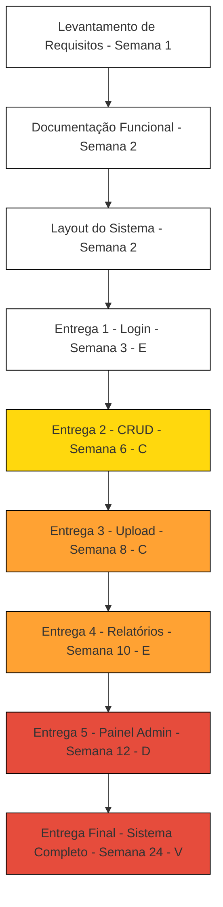
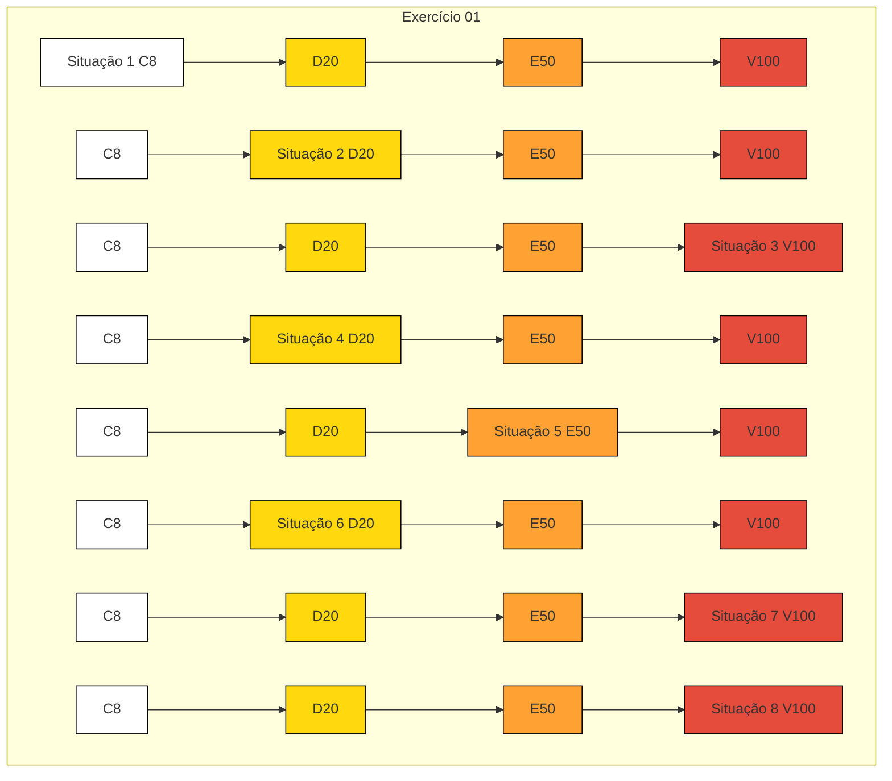
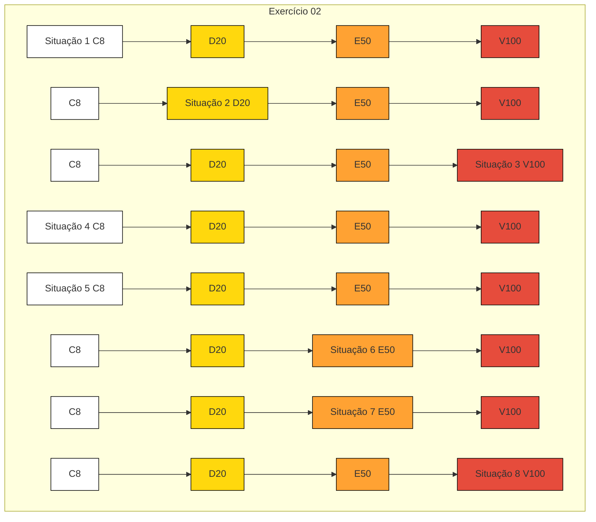

#TechConnect Solutions

```mermaid
graph TD
    E1["Levantamento de Requisitos - Semana 1"]:::branco
    E2["Documentação Funcional - Semana 2"]:::branco
    E3["Layout do Sistema - Semana 2"]:::branco
    E4["Entrega 1 - Login - Semana 3 - E"]:::branco
    E5["Entrega 2 - CRUD - Semana 6 - C"]:::amarelo
    E6["Entrega 3 - Upload - Semana 8 - C"]:::laranja
    E7["Entrega 4 - Relatórios - Semana 10 - E"]:::laranja
    E8["Entrega 5 - Painel Admin - Semana 12 - D"]:::vermelho
    E9["Entrega Final - Sistema Completo - Semana 24 - V"]:::vermelho

    E1 --> E2 --> E3 --> E4 --> E5 --> E6 --> E7 --> E8 --> E9

%% Definições de estilo
classDef branco fill:#ffffff,stroke:#000,stroke-width:1px;
classDef amarelo fill:#FFD80D,stroke:#000,stroke-width:1px;
classDef laranja fill:#FFA233,stroke:#000,stroke-width:1px;
classDef vermelho fill:#E64C3C,stroke:#000,stroke-width:1px;

```

# Metodo-Agil-Crystal

```mermaid
graph TD
  subgraph Exercício 01
    A1["Situação 1 C8"]:::branco --> A2["D20"]:::amarelo --> A3["E50"]:::laranja --> A4["V100"]:::vermelho
    B1["C8"]:::branco --> B2["Situação 2 D20"]:::amarelo --> B3["E50"]:::laranja --> B4["V100"]:::vermelho
    C1["C8"]:::branco --> C2["D20"]:::amarelo --> C3["E50"]:::laranja --> C4["Situação 3 V100"]:::vermelho
    D1["C8"]:::branco --> D2["Situação 4 D20"]:::amarelo --> D3["E50"]:::laranja --> D4["V100"]:::vermelho
    E1["C8"]:::branco --> E2["D20"]:::amarelo --> E3["Situação 5 E50"]:::laranja --> E4["V100"]:::vermelho
    F1["C8"]:::branco --> F2["Situação 6 D20"]:::amarelo --> F3["E50"]:::laranja --> F4["V100"]:::vermelho
    G1["C8"]:::branco --> G2["D20"]:::amarelo --> G3["E50"]:::laranja --> G4["Situação 7 V100"]:::vermelho
    H1["C8"]:::branco --> H2["D20"]:::amarelo --> H3["E50"]:::laranja --> H4["Situação 8 V100"]:::vermelho
  end

  %% Definições de estilo
  classDef branco fill:#ffffff,stroke:#000,stroke-width:1px;
  classDef amarelo fill:#FFD80D,stroke:#000,stroke-width:1px;
  classDef laranja fill:#FFA233,stroke:#000,stroke-width:1px;
  classDef vermelho fill:#E64C3C,stroke:#000,stroke-width:1px;

```

# Metodo-Agil-Crystal

```mermaid
graph TD
  subgraph Exercício 02
    A1["Situação 1 C8"]:::branco --> A2["D20"]:::amarelo --> A3["E50"]:::laranja --> A4["V100"]:::vermelho
    B1["C8"]:::branco --> B2["Situação 2 D20"]:::amarelo --> B3["E50"]:::laranja --> B4["V100"]:::vermelho
    C1["C8"]:::branco --> C2["D20"]:::amarelo --> C3["E50"]:::laranja --> C4["Situação 3 V100"]:::vermelho
    D1["Situação 4 C8"]:::branco --> D2["D20"]:::amarelo --> D3["E50"]:::laranja --> D4["V100"]:::vermelho
    E1["Situação 5 C8"]:::branco --> E2["D20"]:::amarelo --> E3["E50"]:::laranja --> E4["V100"]:::vermelho
    F1["C8"]:::branco --> F2["D20"]:::amarelo --> F3["Situação 6 E50"]:::laranja --> F4["V100"]:::vermelho
    G1["C8"]:::branco --> G2["D20"]:::amarelo --> G3["Situação 7 E50"]:::laranja --> G4["V100"]:::vermelho
    H1["C8"]:::branco --> H2["D20"]:::amarelo --> H3["E50"]:::laranja --> H4["Situação 8 V100"]:::vermelho
  end

  %% Definições de estilo
  classDef branco fill:#ffffff,stroke:#000,stroke-width:1px;
  classDef amarelo fill:#FFD80D,stroke:#000,stroke-width:1px;
  classDef laranja fill:#FFA233,stroke:#000,stroke-width:1px;
  classDef vermelho fill:#E64C3C,stroke:#000,stroke-width:1px;

```
