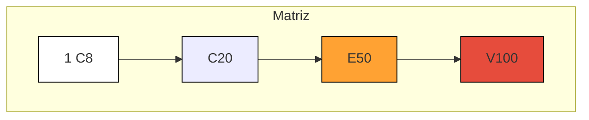

# Metodo-Agil-Crystal

```mermaid
graph TD
  subgraph Matriz
A1["1 C8"]:::branco --> A2["C20"]:::amarelo --> A3["E50"]:::laranja --> A4["V100"]:::vermelho

end
classDef branco fill:#fff, stroke:#000, stroke-width:1px;
classDef amarelo fill:#FFD8D, stroke:#000, stroke-width:1px;
classDef laranja fill:#FFA233, stroke:#000, stroke-width:1px;
classDef vermelho fill:#E64C3C, stroke:#000, stroke-width:1px;
```
