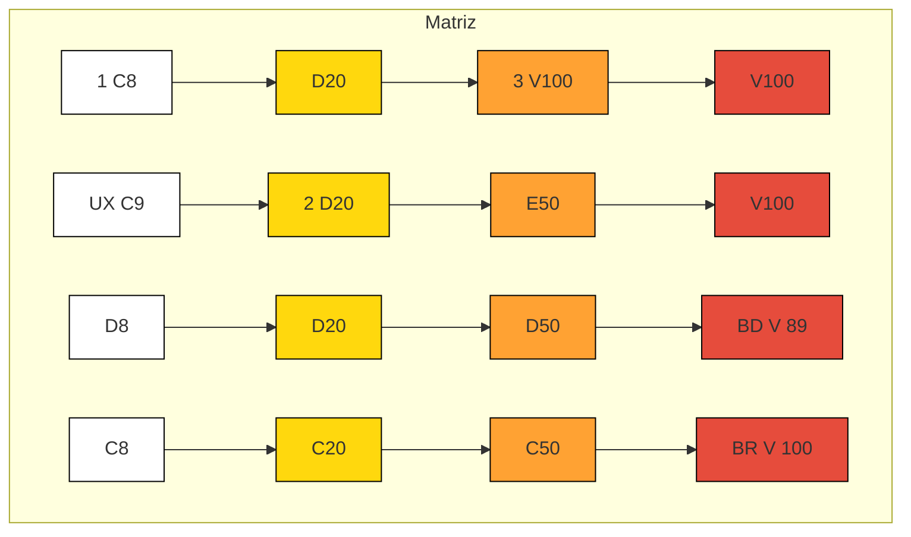

# Metodo-Agil-Crystal

```mermaid
graph TD
  subgraph Matriz
A1["1 C8"]:::branco --> A2["D20"]:::amarelo --> A3["3 V100"]:::laranja --> A4["V100"]:::vermelho
B1["UX C9"]:::branco --> B2["2 D20"]:::amarelo --> B3["E50"]:::laranja --> B4["V100"]:::vermelho
C1["D8"]:::branco --> C2["D20"]:::amarelo --> C3["D50"]:::laranja --> C4["BD V 89"]:::vermelho
D1["C8"]:::branco --> D2["C20"]:::amarelo --> D3["C50"]:::laranja --> D4["BR V 100"]:::vermelho

end
classDef branco fill:#fff, stroke:#000, stroke-width:1px;
classDef amarelo fill:#FFD80D, stroke:#000, stroke-width:1px;
classDef laranja fill:#FFA233, stroke:#000, stroke-width:1px;
classDef vermelho fill:#E64C3C, stroke:#000, stroke-width:1px;
```
